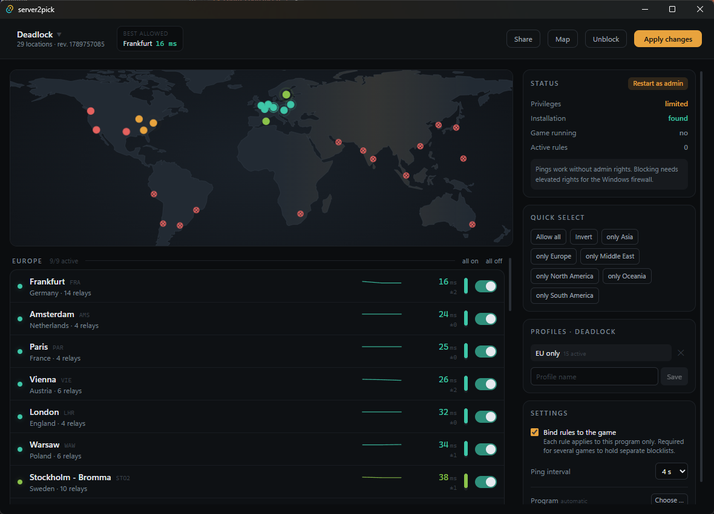

# server2pick

Choose which Valve data centres your matches are allowed to use — per game,
with live ping.

Supports **Deadlock**, **Counter-Strike 2**, **Dota 2** and **Team Fortress 2**.
Windows only. Interface in English and German.

## What it does

These games never expose the IPs of their servers. Everything is tunnelled
through the **Steam Datagram Relay**: Valve runs points of presence around the
world, each with a handful of relay IPs, and the ones you can reach decide
which region you end up in.

server2pick lists every location for the game you pick, measures its latency
continuously, and blocks the ones you do not want with outbound Windows
Firewall rules. Blocked location, skipped region.

## One blocklist per game

The relay pool is shared: Deadlock's 141 relay IPs are a subset of CS2's 210
and Dota 2's 165. Block those IPs machine-wide and you hit every Steam game at
once.

server2pick binds each rule to that game's executable instead — so Deadlock can
sit on Europe while CS2 keeps North America open, both active at the same time.

## Using it

1. Pick a game on first launch. It reopens the last one afterwards; the
   switcher is top left.
2. Turn locations off with the switches or by clicking the map. Changes you
   have not applied yet get an amber ring.
3. **Apply changes.** Windows asks for administrator rights once — the
   *Restart as admin* button sits in the sidebar.
4. Save combinations you use often as **profiles**.

Rules survive reboots. **Unblock** clears the open game; the link in the status
card clears every game at once.

Do not block too much. The relay network routes around blocked locations, and
match confirmation starts running into timeouts — the app warns you once fewer
than three are left.

## Sharing a setup

**Share** produces a code like `S2P1-eyJ2IjoxLCJn…`. Anyone who pastes it gets
the same server selection and the same profiles, for every game at once.

Install paths, language and ping interval stay local: a code never overwrites
where your games live, and it never touches the firewall on its own — the
recipient still presses *Apply changes*.

## Installing

Take the installer from [Releases](../../releases). It is not code signed, so
Windows shows “Unknown publisher” — *More info → Run anyway*.

Ping measurement works without administrator rights. Only the firewall part
needs them, and the app asks when you first block something.

## Limits

- It blocks relays, not game servers — those are not public. In edge cases the
  relay network still routes you into a blocked region.
- IPv4 only; Valve lists no IPv6 relays for these games.
- Team Fortress 2 uses the relay network for Valve matchmaking only, not for
  community servers.
- Windows only.

Unofficial. Not affiliated with Valve.
